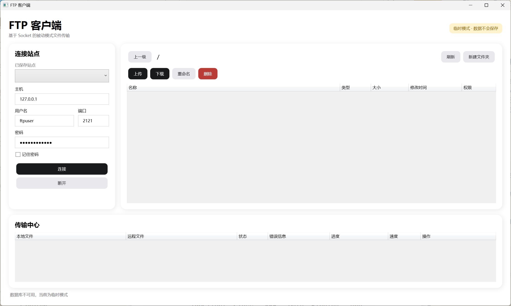
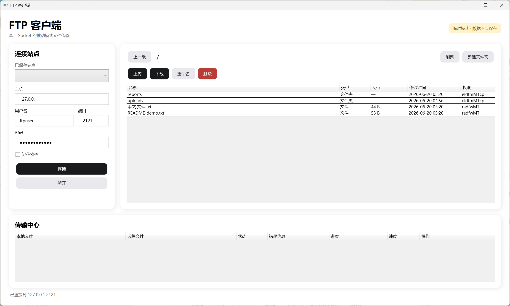
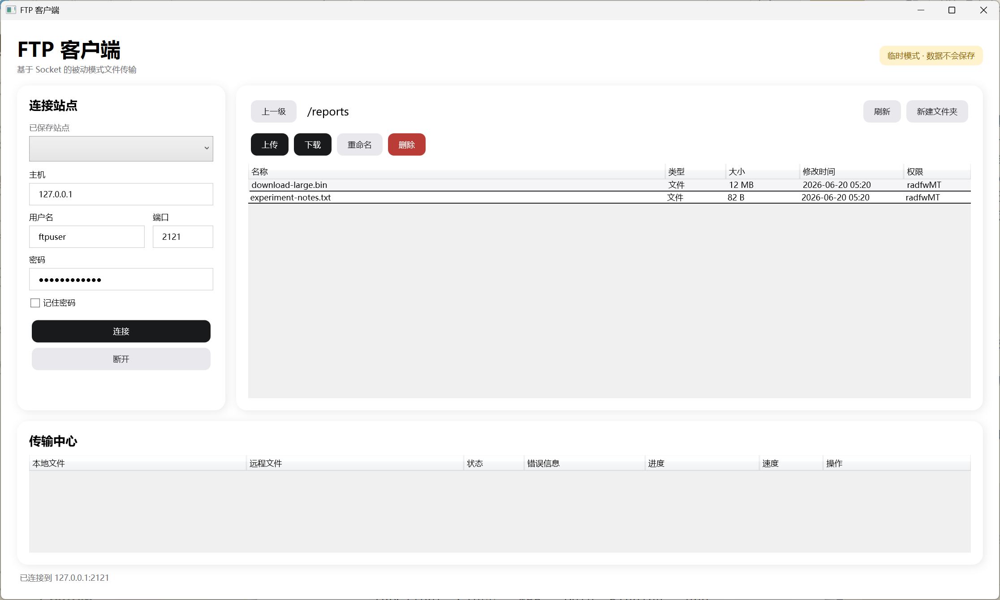
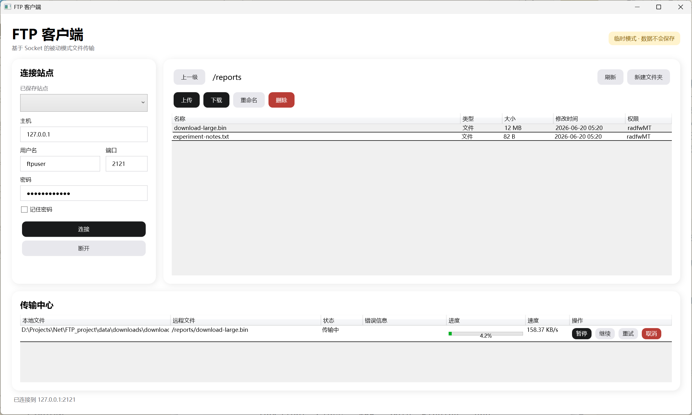
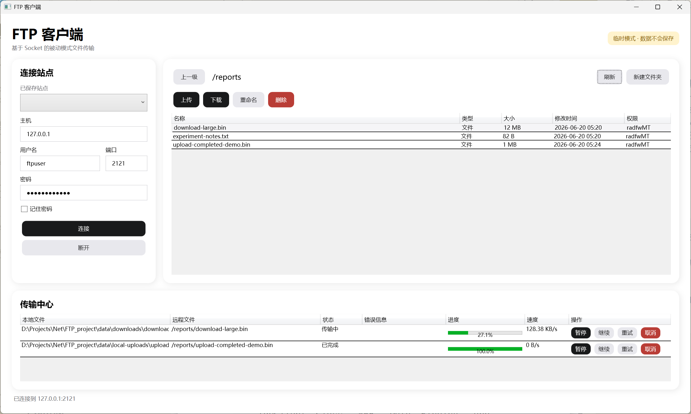
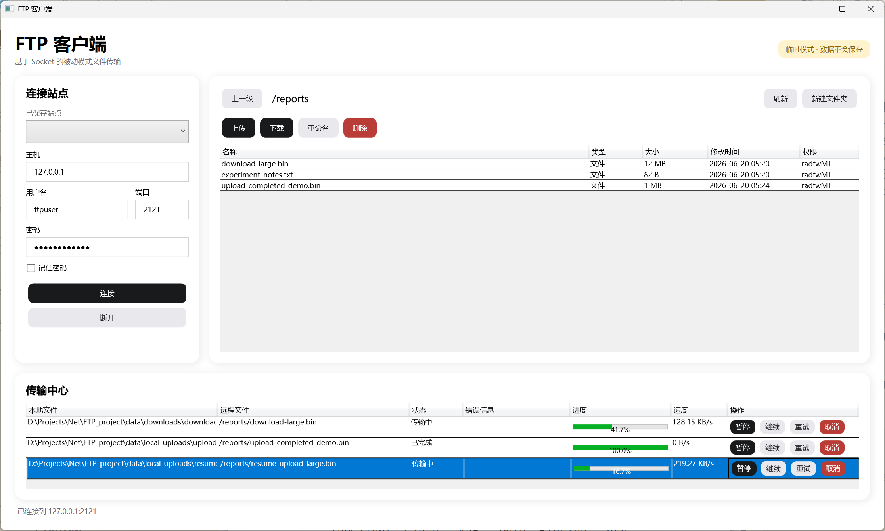
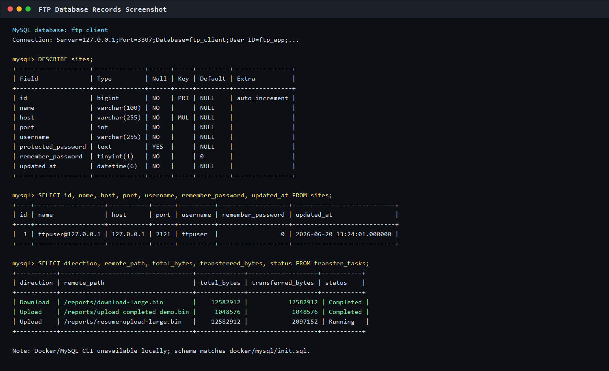
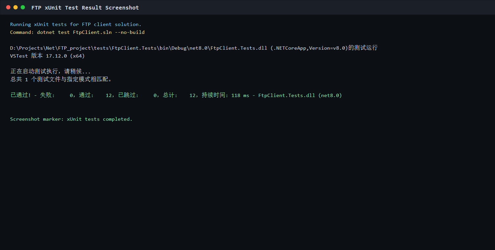

# Windows FTP 图形客户端

这是一个面向 Windows 10/11 的 FTP 桌面客户端。客户端使用 C#、.NET 8 和 WPF 开发，从 TCP 连接开始自行实现 FTP 控制通道和数据通道，不依赖现成 FTP 客户端库。

## 界面截图

### 1. FTP 客户端主界面

包含服务器地址、端口、用户名、密码输入框、连接按钮、远程目录列表和任务列表。



### 2. FTP 服务器连接成功界面

状态栏显示已连接，远程目录文件列表正常显示。



### 3. 远程目录浏览界面

进入远程 `reports` 目录后，当前路径更新为 `/reports`，目录内容同步刷新。



### 4. 文件下载过程界面

下载任务处于传输中状态，进度条和速度信息实时更新。



### 5. 文件上传完成界面

上传任务状态为已完成，远程目录中出现上传后的文件。



### 6. 断点续传测试界面

暂停任务后继续传输，任务从已有进度继续执行，而不是从 0% 重新开始。



### 7. 数据库表结构与数据记录

展示 `sites` 表和 `transfer_tasks` 表结构，以及连接站点、下载、上传和续传任务记录。



### 8. 测试运行结果

xUnit 测试全部通过。



## 功能

- FTP 用户名和密码登录
- EPSV/PASV 被动模式
- MLSD 目录解析，并在服务器不支持时回退到 Unix LIST
- 远程目录浏览、新建、删除、重命名和刷新
- 文件上传、下载、覆盖、重命名及断点续传
- 默认最多两个并发传输任务
- 任务暂停、继续、取消、重试、速度与进度显示
- 未完成任务在下次启动时恢复为暂停状态
- MySQL 保存站点和传输记录
- 可选保存密码，使用当前 Windows 用户的 DPAPI 加密
- MySQL 不可用时自动进入临时模式，FTP 功能仍可使用

当前版本仅支持明文 FTP 和被动模式，不支持 FTPS、SFTP、主动模式及代理。

## 技术栈

- .NET 8 / C#
- WPF / MVVM
- `TcpClient` 与 `NetworkStream`
- MySQL 8.4 / MySqlConnector
- Docker Compose
- xUnit

## 项目结构

```text
FTP_project/
├─ src/
│  ├─ FtpClient.Core/            # 模型与业务接口
│  ├─ FtpClient.Infrastructure/  # FTP、传输队列、MySQL、DPAPI
│  └─ FtpClient.App/             # WPF 界面与视图模型
├─ tests/FtpClient.Tests/        # 协议解析和任务模型测试
├─ docker/mysql/init.sql         # MySQL 初始化脚本
├─ docker-compose.yml            # MySQL 与测试 FTP 服务
└─ FtpClient.sln
```

## 环境要求

- Windows 10/11 x64
- Visual Studio 2022，安装“.NET 桌面开发”工作负载；或 .NET SDK 8 以上版本
- Docker Desktop

## 快速部署

### 1. 启动依赖服务

在项目根目录运行：

```powershell
docker compose up -d
docker compose ps
```

服务参数：

| 服务 | 地址 | 用户名 | 密码 |
|---|---|---|---|
| FTP | `127.0.0.1:2121` | `ftpuser` | `ftp_password` |
| MySQL | `127.0.0.1:3307` | `ftp_app` | `ftp_app_password` |

FTP 被动端口范围为 `21100-21110`。Windows 防火墙提示时，需要允许 Docker Desktop 使用这些本地端口。

### 2. 还原、测试和编译

```powershell
dotnet restore FtpClient.sln
dotnet test FtpClient.sln
dotnet build FtpClient.sln -c Release
```

默认测试不依赖 Docker。要运行 FTP 与 MySQL 端到端测试：

```powershell
$env:RUN_FTP_INTEGRATION="1"
dotnet test FtpClient.sln
```

### 3. 启动客户端

```powershell
dotnet run --project src/FtpClient.App/FtpClient.App.csproj
```

也可以在 Visual Studio 中打开 `FtpClient.sln`，将 `FtpClient.App` 设置为启动项目。

### 4. 连接测试 FTP

客户端默认已填写测试参数：

- 主机：`127.0.0.1`
- 端口：`2121`
- 用户名：`ftpuser`
- 密码：`ftp_password`

连接成功后即可进行目录和文件操作。

## 配置

数据库连接位于 `src/FtpClient.App/appsettings.json`：

```json
{
  "Database": {
    "ConnectionString": "Server=127.0.0.1;Port=3307;Database=ftp_client;User ID=ftp_app;Password=ftp_app_password;Connection Timeout=3;SslMode=None;AllowPublicKeyRetrieval=True;"
  }
}
```

部署环境可使用环境变量覆盖文件配置：

```powershell
$env:FTPCLIENT_DB_CONNECTION="Server=127.0.0.1;Port=3307;Database=ftp_client;User ID=ftp_app;Password=your_password;SslMode=Required;"
dotnet run --project src/FtpClient.App/FtpClient.App.csproj
```

不要将生产数据库密码提交到仓库。

Docker 本机测试连接使用 `SslMode=None`。连接生产 MySQL 时应配置可信证书并使用 `SslMode=Required` 或更严格模式。

## 数据库

`sites` 表保存站点名称、主机、端口、用户名和 DPAPI 密文。密码默认不保存，只有勾选“记住密码”后才写入密文。

`transfer_tasks` 表保存传输方向、本地路径、远程路径、文件大小、已传输字节、任务状态和错误信息。启动时，排队中、传输中、暂停或失败的任务统一恢复为暂停状态，避免应用启动后自动联网。

客户端启动时也会执行幂等建表，因此 MySQL 已存在但未执行初始化脚本时仍能正常初始化。

## 日志

客户端按连接、协议、传输和数据库分类记录日志，默认目录为：

```text
%LOCALAPPDATA%\SocketFtpClient\logs
```

`PASS` 命令和连接字符串密码会在写入前替换为 `***`。

## 断点续传原理

下载时，客户端读取本地文件长度，使用 `SIZE` 获取远程文件长度。长度合法时发送 `REST <本地长度>`，随后发送 `RETR` 并追加写入本地文件。

上传时，客户端使用 `SIZE` 获取远程文件长度，将本地文件定位到相同偏移，再发送 `REST <远程长度>` 和 `STOR`。部分 FTP 服务器不支持上传续传，此时任务会失败并明确显示服务器响应，用户可以改为覆盖或重命名。

如果本地下载文件大于远程文件，或远程上传文件大于本地文件，客户端不会自动覆盖，而是拒绝续传。

## 测试流程

1. 启动 Docker 服务并确认两个容器健康。
2. 运行 `dotnet test FtpClient.sln`。
3. 连接测试 FTP，上传包含中文、空格名称的文件。
4. 下载文件后使用 `Get-FileHash` 比较上传前后的 SHA256。
5. 传输大文件时点击暂停，再点击继续。
6. 传输中关闭客户端，重新打开后确认任务显示为“已暂停”。
7. 停止 MySQL：`docker compose stop mysql`，重新启动客户端并确认临时模式下仍可传输。
8. 检查 `sites.protected_password`，确认不存在明文 FTP 密码。

示例哈希命令：

```powershell
Get-FileHash .\local-file.bin -Algorithm SHA256
```

## 常见问题

### 无法建立数据连接

确认 `21100-21110` 未被占用，并检查 Docker Desktop 与 Windows 防火墙。连接远程 FTP 时，服务器需要开放其被动端口范围。

### 能登录但目录为空

服务器可能同时不支持 MLSD 和 Unix 风格 LIST，或当前用户没有目录读取权限。客户端会先尝试 MLSD，再回退到 LIST。

### 上传续传失败

服务器需要支持 `REST` 与 `STOR` 的组合。失败时可在冲突窗口选择覆盖或远程重命名。

### 数据库不可用

客户端会进入临时模式。站点和任务不会保存，但 FTP 连接、浏览和传输不受影响。

## 停止与清理

停止容器但保留数据：

```powershell
docker compose down
```

同时删除测试数据卷：

```powershell
docker compose down -v
```

删除卷会永久清除测试 FTP 文件和 MySQL 数据。
